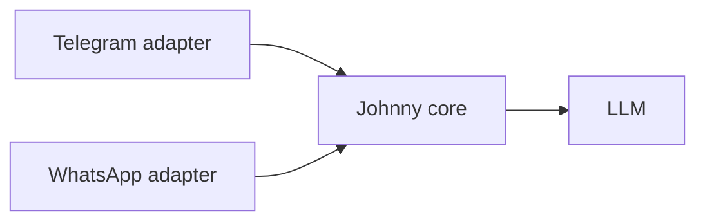

# Connecting Johnny to WhatsApp: initial research

**TLDR: For immediate dogfooding in the team's existing Israeli WhatsApp group, first reuse or adapt Yaniv's working implementation. Meta's official Groups API is currently a poor fit, so the fallback should be a dedicated-number, disposable WhatsApp Web bridge while Telegram remains available.**

**Status:** Initial research  
**Date:** 2026-07-28  
**Confidence:** Medium-high on the platform constraints, medium on the recommended library until Yaniv's implementation is inspected.

## Decision

Do not begin by building against Meta's official Cloud API.

1. Get access to Yaniv's current WhatsApp implementation and identify its library, hosting, number, authentication flow, and known failure modes.
2. If it is understandable and reusable, put a thin Johnny adapter around it.
3. If it is not available or is too brittle, run a one-session spike with `whatsapp-web.js` and a dedicated test number.
4. Keep the Telegram bot working and move Johnny's prompt, whitelist, and response policy into channel-neutral code.

Time-box the Yaniv handoff to 48 hours. Reuse it only if The Last Founder receives source, deployment access, session recovery control, and ownership of a dedicated number. This is enough research to choose the next experiment. A deeper technical comparison before seeing Yaniv's code would mostly be wasted work.

## Why the official route is not the current answer

Meta now documents an official [WhatsApp Groups API](https://developers.facebook.com/documentation/business-messaging/whatsapp/groups), but it does not solve Johnny's immediate use case:

- Access requires an [Official Business Account](https://developers.facebook.com/documentation/business-messaging/whatsapp/groups/get-started), not merely a normal or WhatsApp Business app number.
- Groups are API-created and invite-only. The documented flow creates a new group, returns an invite link, and then invites participants. No documented route was found for attaching Johnny to an existing ordinary WhatsApp group.
- A group supports at most eight participants, with the business number acting as creator and admin.
- Meta's [Business app Coexistence onboarding](https://developers.facebook.com/documentation/business-messaging/whatsapp/embedded-signup/onboarding-business-app-users) explicitly says group chats are not synchronized. There is also no documented group-history fetch endpoint.
- Meta's [Business Solution Terms](https://www.whatsapp.com/legal/business-solution-terms), updated 2026-03-06, restrict AI providers from using the Business Solution when AI is the primary functionality offered. The exception named in the terms is for users with EEA or Brazil phone numbers. Johnny is AI-first and the dogfood group uses Israeli numbers, so eligibility is at least materially uncertain.

The official API remains worth revisiting later if access expands or Meta confirms Johnny is permitted. It is not a credible blocker-free path for the next co-work.

## Practical options

| Route | Existing group | Setup and maintenance | Main risk | Fit now |
|---|---|---|---|---|
| Yaniv's current implementation | Probably, to verify | Unknown until handoff | Hidden dependencies or no source access | **Best first move** |
| Meta Groups API | No documented attach-to-existing flow | OBA approval, Cloud API, webhooks | Eligibility, eight-person cap, AI policy | **Do not pursue now** |
| [`whatsapp-web.js`](https://github.com/wwebjs/whatsapp-web.js) | Yes | Node.js, Chromium, QR session, persistent `LocalAuth` | Unofficial, breakage or account block | **Best fallback spike** |
| [`Baileys`](https://github.com/WhiskeySockets/Baileys) | Yes | Node.js WebSocket client, persisted auth | Unofficial, breaking changes, more protocol work | Good if Yaniv already uses it |
| [`OpenBSP`](https://github.com/matiasbattocchia/open-bsp-api) WhatsApp Web bridge | Likely | Supabase plus a `whatsmeow` bridge | More infrastructure than Johnny needs | Revisit if a hosted path proves simpler |
| [`WPPConnect Server`](https://github.com/wppconnect-team/wppconnect-server) | Yes | Ready REST API, but Docker and Chrome | Unofficial plus another service to operate | Backup, not first choice |

All WhatsApp Web routes are unofficial. WhatsApp's [Terms of Service](https://www.whatsapp.com/legal/terms-of-service) prohibit impermissible or unauthorized automated access, and the projects themselves warn that accounts may be blocked. Use a dedicated TLF-owned number, persistent encrypted session storage, low message volume, an allowlisted group, explicit group consent, rate limiting, and a kill switch. Assume the bridge may need replacement.

## What must be learned from Yaniv

Before choosing a library, answer:

1. Where is the source code, and can the team edit and open-source it?
2. Which provider or library does it use?
3. Does it already receive and send messages in the exact existing group?
4. Which phone number owns the session, and can it be dedicated to Johnny?
5. How are QR login, session persistence, reconnects, and deployment handled?
6. Has the account been blocked, logged out, or broken by WhatsApp updates?
7. Can Johnny reuse the transport without inheriting its agent logic?

## Recommended technical shape

Johnny should not become a Telegram bot plus a separate WhatsApp bot. Both channels should call one small core:



Normalize each incoming message into:

```text
channel, chat_id, user_id, text, mentioned_johnny, replied_to_johnny, is_private
```

The core decides whether to answer, loads the same Markdown context, calls the model, and returns text to the adapter. Phone numbers replace Telegram user IDs for the WhatsApp whitelist.

## One-session spike

The spike succeeds only if it proves all of these:

1. A dedicated Johnny number joins the existing dogfood group.
2. Johnny receives new group messages and sends a reply.
3. In the group, Johnny answers only when mentioned or replied to.
4. In a DM, Johnny answers without requiring a mention.
5. Only whitelisted phone numbers can trigger it.
6. The login session survives one process restart without another QR scan.
7. Johnny does not answer itself or create a response loop.

Do not promise historical backfill. Start storing messages after connection and treat any synced older history as a non-guaranteed bonus.

## Open questions

- Will Yaniv provide editable source and a working session before Cowork 1?
- Which existing WhatsApp group is the first dogfood target, and how many members does it have?
- Is the team comfortable using a dedicated number that could be blocked?
- Do all members consent to new group messages being processed by an external LLM?

## Primary sources

- [Meta WhatsApp Groups API](https://developers.facebook.com/documentation/business-messaging/whatsapp/groups)
- [Meta Groups API setup and eligibility](https://developers.facebook.com/documentation/business-messaging/whatsapp/groups/get-started)
- [Meta Groups API group management](https://developers.facebook.com/documentation/business-messaging/whatsapp/groups/reference)
- [Meta Business app Coexistence onboarding](https://developers.facebook.com/documentation/business-messaging/whatsapp/embedded-signup/onboarding-business-app-users)
- [WhatsApp Business Solution Terms](https://www.whatsapp.com/legal/business-solution-terms)
- [WhatsApp Terms of Service](https://www.whatsapp.com/legal/terms-of-service)
- [`whatsapp-web.js`](https://github.com/wwebjs/whatsapp-web.js)
- [Baileys](https://github.com/WhiskeySockets/Baileys)
- [OpenBSP](https://github.com/matiasbattocchia/open-bsp-api)
- [WPPConnect Server](https://github.com/wppconnect-team/wppconnect-server)
